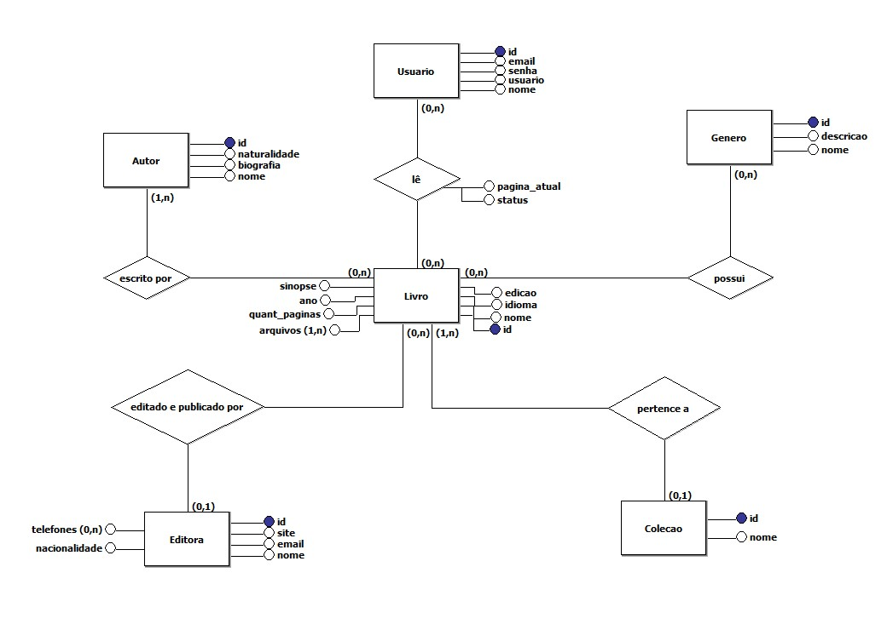
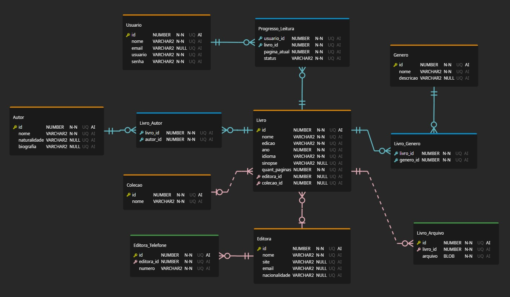

    Desenvolvido por: Filipe Siota e Isadora Aguiar
    Turma: DS3/2022

# Trabalho de Banco de Dados

- [Trabalho de Banco de Dados](#trabalho-de-banco-de-dados)
  - [Definição de escopo](#definição-de-escopo)
  - [Potenciais usuários](#potenciais-usuários)
  - [Pesquisa inicial de levantamento de informações](#pesquisa-inicial-de-levantamento-de-informações)
  - [Motivação pela escolha do escopo](#motivação-pela-escolha-do-escopo)
  - [Levantamento dos requisitos](#levantamento-dos-requisitos)
  - [Modelos do banco de dados](#modelos-do-banco-de-dados)
    - [Projeto Conceitual](#projeto-conceitual)
    - [Projeto Lógico](#projeto-lógico)
    - [Projeto Físico (Modelo ER)](#projeto-físico-modelo-er)
  - [Comandos de criação e inserção (DDL e DML)](#comandos-de-criação-e-inserção-ddl-e-dml)
  - [Comandos de consulta e views](#comandos-de-consulta-e-views)

## Definição de escopo

Sistema de gerenciamento de leituras.

## Potenciais usuários

O público alvo são leitores de literatura literária.

## Pesquisa inicial de levantamento de informações

Sistemas já existentes (disponíveis na PlayStore):

- ReadEra
- Skoob

## Motivação pela escolha do escopo

Visa organizar as leituras realizadas em Ebooks, pois facilita a portabilidade e manuseio ao longo da leitura.

## Levantamento dos requisitos

- O usuário poderá adicionar/excluir (exclusão virtual) livros;
  - Somente o usuário que adicionou o livro poderá alterar seus dados;
  - Somente o usuário que adicionou o livro poderá adicionar/excluir (exclusão virtual) arquivos (e-books) vinculados a um livro;
- O usuário poderá iniciar uma leitura;
  - Alterar o status da leitura;
  - Visualizar leituras concluídas/em andamento;
- O usuário poderá pesquisar/visualizar autores/editoras/livros/coleções/gêneros;
  - Filtrar a visualização de livros por autor/editora/coleção/gênero;
- Criar uma coleção de livros;
  - Qualquer usuário poderá incluir livros.

## Modelos do banco de dados

### Projeto Conceitual

### Projeto Lógico

- [Clique aqui para visualizar](./ProjetoLogico/ModeloLogico.md)

### Projeto Físico (Modelo ER)

## Comandos de criação e inserção (DDL e DML)

- [Comandos de criação (DDL)](./ProjetoFisico/DDL.sql)
- [Comandos de inserção (DML)](./ProjetoFisico/DML.sql)

## Comandos de consulta e views

- [Clique aqui para visualizar os comandos DQL](./ProjetoFisico/DQL.sql)
- [Clique aqui para visualizar o PDF com os comandos e prints](./ProjetoFisico/DQL.pdf)
